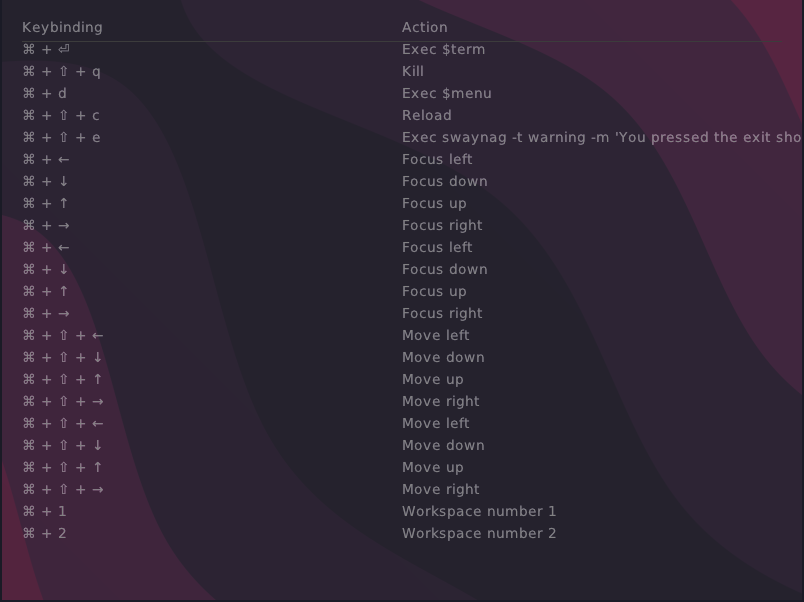
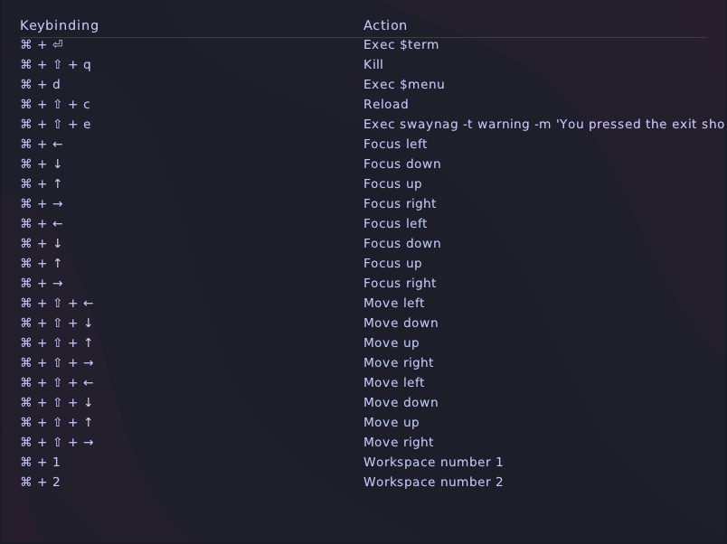
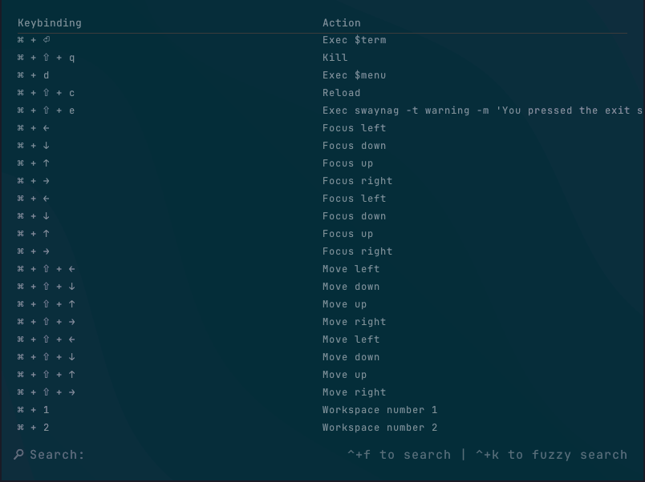
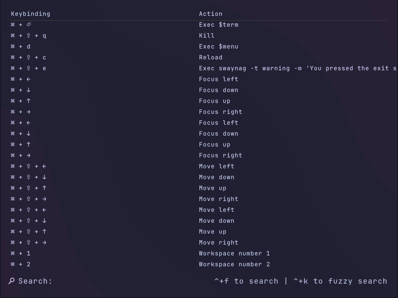
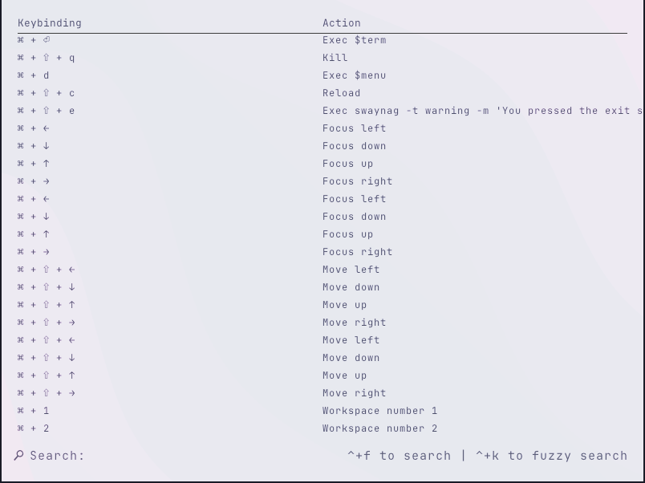
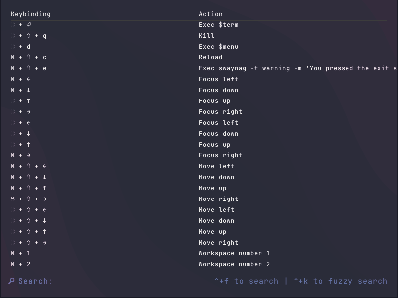
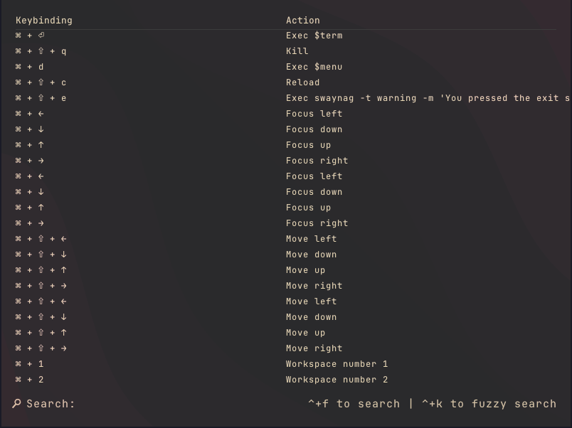
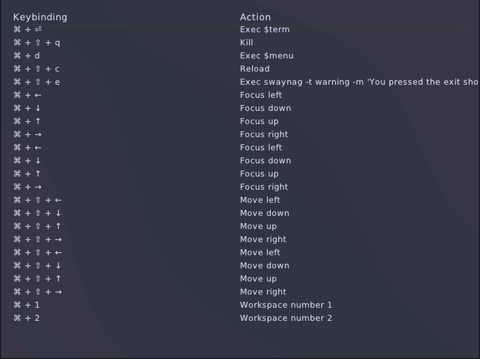

# Swindings

**View sway keybindings**

[demo](https://github.com/user-attachments/assets/5d8c331c-d5ad-4ddc-b6cc-b9aa46668755)

## Installation

### Prerequisites

- Sway window manager (Wayland)

### One line install (recommended)

```
curl -sSfL https://sondalex.github.io/swindings/install.sh | sh
```


## Usage

Run:

```
swindings
```


## Theming

Those themes are available:

**Default**



---

**Tokyo-Night**



---
**Solarized Dark**



---
**Catppuccin Mocha**



---
**Catppuccin Latte**



---
**Dracula**



---
**Gruvbox Dark**



---
**Nord**



---


If you want to switch for Tokyo-Night:

```bash
cp config/tokyo-night.toml ~/.config/swindings/config.toml
```


## Recommendation

Add keymap to your `~/.config/sway/config`:

```ini
bindsym $mod+k+m swindings
```

## Building from source

```bash
git clone https://github.com/sondalex/swindings.git
git submodule update --init --recursive
```

## Development

### Testing

```bash
zig build test
```

### Memory checking

`WITH_VALGRIND` is injected by passing `-Dvalgrind=true` to the build system.

Build the binary with `-Dvalgrind=true`:

```bash
zig build -j1 -Dvalgrind=true
```

Then run valgrind against it:

**On unit tests**

```bash
valgrind --leak-check=full \
    --show-leak-kinds=all \
    --track-origins=yes \
    --error-exitcode=1 \
    --suppressions=valgrind/swindings.supp \
    zig-out/bin/unit_tests
```

**On executable**

Requires a live Wayland compositor (cannot run in CI). Build with `-Dvalgrind=true`:

```bash
valgrind --leak-check=full \
    --show-leak-kinds=all \
    --track-origins=yes \
    --error-exitcode=1 \
    --suppressions=valgrind/swindings.supp \
    --log-file=raw.log \
    zig-out/bin/swindings
```


### Generating compile_commands.json

```bash
zig build cdb
```

### Static analysis (clang-tidy)

Requires `clang-tidy` and a `compile_commands.json`. Generate the compilation
database first:

```bash
zig build cdb
```

Then run clang-tidy against the project sources:

```bash
clang-tidy \
    src/cli.c src/config.c src/display.c src/keyicon.c \
    src/main.c src/search.c src/structures.c src/theme.c \
    -p compile_commands.json
```

